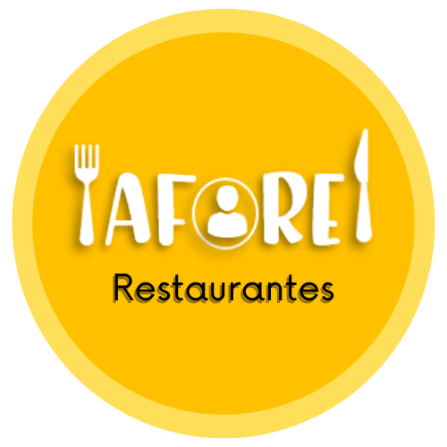

# Afore 

#About
The arrival of COVID-19 to Colombia force the population to lock up in their homes and keep a mandatory quarentine ordered by the national government of Colombia in the way to avoid the fast spread of the virus. Colombians had to make a change in their lifestyles because going out was not safe anymore. The social activities as going to a dinner with friends, familiar meetings, and night life were cataloged as dangerous activities because of the high risk of virus fast spread. However, months later the activities that were common started to resume, restaurants allowed the entry of a quantity of clients, malls opted for the same entry that exit in the way to control the afore and even the cinemas reinvented with the drive-ins.

With the resumption of social activities, a problem is identified. Despite the fact that for all citizens it is a great relief to be able to go out to dinner, visit friends, meet with family, eat ice cream in a mall, it became very common to hear the word "Afore", a basis word of the new reality. All public places must guarantee that their clients maintain a minimum distance of 2 meters, that is, in a place where before 100 people could be, now only can be 50, it means, their maximum allowed capacity is 50 people. This means that now everyone can go out, but if the place where they are going has its maximum capacity, it is most likely that they will have to choose another place or go back home.

This problem brings with it that people decide many times not to go out or on many occasions waste their time since when they arrive at a place they are not allowed to enter because the place has already reached its maximum capacity, that is why Afore is presented as a software regarding the control of the capacity of the service companies. Afore will be specialized for restaurants, allowing them to control the capacity of the place and other functionalities such as keeping inventory records, sales, product management and the ability to generate reports in pdf and Excel for data filtering depending to the need. However, this is only the first step towards the final objective of the software because a mobile application will be developed where citizens and potential clients would know the capacity of the restaurants, and make their reservations so they will not miss the trip and feel sure that when they arrive at the restaurant they will have their reservated space respecting the capacity.

##Technical Conditions
- Logical part of the program is done in java language, user interface is done with javafx and developed in the ECLIPSE integrated development environment.

- Afore requires the Java SE Runtime Enviroment (JRE)

- Operating System: Windows.

##Documentation

-[Documentation of the app](docs/Documentacion/Tarea Integradora 3.pdf)

-[Video Presentation of the App](https://youtu.be/697ePrPSoqM)

